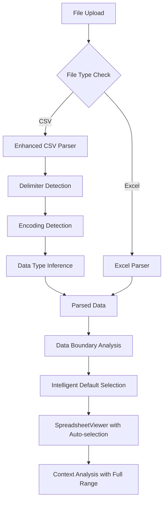

# Design Document

## Overview

This design addresses two critical bugs in the Excel Context Engine:

1. **CSV Upload Bug**: CSV files are not being properly processed due to issues in the SpreadsheetParser and file upload handling
2. **Default Selection Bug**: The system defaults to selecting only cell A1 instead of intelligently selecting the entire data range

The solution involves enhancing the CSV parsing logic, improving the default selection algorithm, and ensuring proper integration between frontend and backend components.

## Architecture

### Bug Analysis

#### CSV Upload Issues
After analyzing the codebase, the CSV upload issues stem from:
1. **MIME Type Handling**: CSV files may have inconsistent MIME types (`text/csv`, `application/csv`, or even `text/plain`)
2. **Delimiter Detection**: The current parser doesn't handle different CSV delimiters (semicolon, tab)
3. **Encoding Issues**: CSV files may have different character encodings (UTF-8, UTF-16, Windows-1252)
4. **Data Type Detection**: CSV data type inference is less reliable than Excel's built-in type information

#### Default Selection Issues
The default selection problems are caused by:
1. **Hard-coded A1 Selection**: The SpreadsheetViewer component initializes with no selection, defaulting to A1
2. **No Intelligent Range Detection**: The system doesn't analyze the actual data boundaries
3. **Missing Auto-selection Logic**: There's no mechanism to automatically select the full data range on load

### Solution Architecture



## Components and Interfaces

### Enhanced CSV Parser

**Purpose**: Robust CSV parsing with automatic delimiter and encoding detection

**Key Enhancements**:
- Multi-delimiter detection (comma, semicolon, tab, pipe)
- Encoding detection and conversion
- Improved data type inference
- Better error handling and recovery

**New Methods**:
```typescript
interface EnhancedCSVParser {
  detectDelimiter(csvContent: string): string;
  detectEncoding(buffer: Buffer): string;
  parseCSVWithDelimiter(content: string, delimiter: string): any[][];
  inferDataTypes(rows: any[][]): DataType[];
  validateCSVStructure(rows: any[][]): ValidationResult;
}
```

### Data Boundary Analyzer

**Purpose**: Analyze spreadsheet data to determine intelligent default selection ranges

**Key Features**:
- Detect actual data boundaries (non-empty cells)
- Identify header rows
- Handle sparse data with gaps
- Provide fallback ranges for edge cases

**Interface**:
```typescript
interface DataBoundaryAnalyzer {
  analyzeDataBoundaries(sheet: Sheet): DataBoundaries;
  detectHeaders(sheet: Sheet): HeaderInfo;
  calculateOptimalRange(boundaries: DataBoundaries): string;
  validateRangeSize(range: string): RangeValidation;
}

interface DataBoundaries {
  minRow: number;
  maxRow: number;
  minCol: number;
  maxCol: number;
  totalCells: number;
  emptyCells: number;
  hasHeaders: boolean;
}
```

### Auto-Selection Manager

**Purpose**: Manage intelligent default selection and user selection preferences

**Key Features**:
- Apply intelligent defaults on file load
- Respect user manual selections
- Maintain selection state per sheet
- Provide selection change notifications

**Interface**:
```typescript
interface AutoSelectionManager {
  calculateDefaultSelection(sheet: Sheet): string;
  applyDefaultSelection(sheetIndex: number): void;
  updateUserSelection(range: string, isManual: boolean): void;
  getActiveSelection(sheetIndex: number): SelectionState;
  resetToDefaults(): void;
}

interface SelectionState {
  range: string;
  isManual: boolean;
  timestamp: Date;
  boundaries: DataBoundaries;
}
```

## Data Models

### Enhanced CSV Configuration

```typescript
interface CSVParseConfig {
  delimiter?: string;
  encoding?: string;
  hasHeaders?: boolean;
  skipEmptyLines?: boolean;
  trimWhitespace?: boolean;
  maxRows?: number;
  fallbackDelimiters?: string[];
}

interface CSVParseResult {
  data: any[][];
  delimiter: string;
  encoding: string;
  headers?: string[];
  dataTypes: DataType[];
  warnings: string[];
  rowCount: number;
  columnCount: number;
}
```

### Selection Management Models

```typescript
interface DefaultSelectionConfig {
  maxCells: number; // Maximum cells to select by default
  includeHeaders: boolean;
  minimumRange: string; // Fallback minimum range (e.g., "A1:J20")
  respectUserSelections: boolean;
}

interface SelectionAnalysis {
  recommendedRange: string;
  confidence: number;
  reasoning: string[];
  alternatives: string[];
  warnings: string[];
}
```

## Implementation Strategy

### Phase 1: Enhanced CSV Parser

1. **Delimiter Detection Algorithm**:
   - Analyze first few rows for common delimiters
   - Count delimiter occurrences and consistency
   - Use statistical analysis to determine most likely delimiter
   - Fallback to comma if detection fails

2. **Encoding Detection**:
   - Use chardet library or similar for encoding detection
   - Try UTF-8 first, then common encodings
   - Provide encoding override option in API

3. **Improved Data Type Inference**:
   - Analyze sample of data from each column
   - Use regex patterns for common data types
   - Handle locale-specific number and date formats
   - Provide confidence scores for type detection

### Phase 2: Data Boundary Analysis

1. **Boundary Detection Algorithm**:
   ```typescript
   function analyzeDataBoundaries(sheet: Sheet): DataBoundaries {
     let minRow = Infinity, maxRow = -1;
     let minCol = Infinity, maxCol = -1;
     let totalCells = 0, emptyCells = 0;
     
     for (let row = 0; row < sheet.dimensions.rows; row++) {
       for (let col = 0; col < sheet.dimensions.cols; col++) {
         const cell = sheet.data[row]?.[col];
         totalCells++;
         
         if (cell && cell.value !== null && cell.value !== '') {
           minRow = Math.min(minRow, row);
           maxRow = Math.max(maxRow, row);
           minCol = Math.min(minCol, col);
           maxCol = Math.max(maxCol, col);
         } else {
           emptyCells++;
         }
       }
     }
     
     return {
       minRow: minRow === Infinity ? 0 : minRow,
       maxRow: maxRow === -1 ? 0 : maxRow,
       minCol: minCol === Infinity ? 0 : minCol,
       maxCol: maxCol === -1 ? 0 : maxCol,
       totalCells,
       emptyCells,
       hasHeaders: detectHeaders(sheet, minRow, maxRow, minCol, maxCol)
     };
   }
   ```

2. **Header Detection**:
   - Analyze first row for text vs. numeric patterns
   - Compare data types between first row and subsequent rows
   - Look for common header patterns and naming conventions

### Phase 3: Auto-Selection Integration

1. **Frontend Integration**:
   - Modify SpreadsheetViewer to accept default selection prop
   - Add useEffect to apply default selection on data load
   - Ensure selection state is properly managed

2. **Backend Integration**:
   - Add boundary analysis to spreadsheet parsing pipeline
   - Include recommended selection in API responses
   - Provide selection metadata for frontend consumption

## Error Handling

### CSV-Specific Error Handling

```typescript
enum CSVErrorCode {
  DELIMITER_DETECTION_FAILED = 'CSV_DELIMITER_DETECTION_FAILED',
  ENCODING_DETECTION_FAILED = 'CSV_ENCODING_DETECTION_FAILED',
  MALFORMED_CSV = 'CSV_MALFORMED',
  INCONSISTENT_COLUMNS = 'CSV_INCONSISTENT_COLUMNS',
  EMPTY_FILE = 'CSV_EMPTY_FILE'
}

interface CSVError extends Error {
  code: CSVErrorCode;
  details: {
    detectedDelimiter?: string;
    detectedEncoding?: string;
    rowNumber?: number;
    columnCount?: number;
    suggestions: string[];
  };
}
```

### Selection Error Handling

```typescript
enum SelectionErrorCode {
  INVALID_RANGE = 'SELECTION_INVALID_RANGE',
  RANGE_TOO_LARGE = 'SELECTION_RANGE_TOO_LARGE',
  NO_DATA_FOUND = 'SELECTION_NO_DATA_FOUND'
}

interface SelectionError extends Error {
  code: SelectionErrorCode;
  details: {
    requestedRange?: string;
    maxAllowedCells?: number;
    suggestedRange?: string;
    fallbackRange?: string;
  };
}
```

## Testing Strategy

### CSV Parser Testing

1. **Test Cases**:
   - Various CSV delimiters (comma, semicolon, tab, pipe)
   - Different encodings (UTF-8, UTF-16, Windows-1252)
   - Malformed CSV files (missing quotes, inconsistent columns)
   - Large CSV files (performance testing)
   - CSV files with special characters and unicode

2. **Test Data**:
   - Sample CSV files with known characteristics
   - Generated test data with edge cases
   - Real-world CSV files from different sources

### Selection Algorithm Testing

1. **Test Scenarios**:
   - Empty spreadsheets
   - Spreadsheets with headers
   - Sparse data with gaps
   - Very large datasets
   - Multiple sheets with different data patterns

2. **Validation**:
   - Verify correct boundary detection
   - Ensure reasonable default ranges
   - Test performance with large datasets
   - Validate user selection preservation

## Performance Considerations

### CSV Processing Optimization

1. **Streaming Parser**: For large CSV files, implement streaming parsing to avoid memory issues
2. **Delimiter Sampling**: Only analyze first N rows for delimiter detection to improve performance
3. **Lazy Type Inference**: Defer data type analysis until needed for context analysis

### Selection Performance

1. **Boundary Caching**: Cache boundary analysis results to avoid recalculation
2. **Progressive Analysis**: For very large sheets, analyze boundaries progressively
3. **Range Validation**: Implement efficient range validation to prevent performance issues

## Migration Strategy

### Backward Compatibility

1. **API Compatibility**: Ensure existing API endpoints continue to work
2. **Default Behavior**: New intelligent selection should not break existing workflows
3. **Graceful Degradation**: If new features fail, fall back to current behavior

### Rollout Plan

1. **Phase 1**: Deploy enhanced CSV parser with existing selection behavior
2. **Phase 2**: Add intelligent selection as opt-in feature
3. **Phase 3**: Make intelligent selection the default behavior
4. **Phase 4**: Remove legacy selection code after validation period