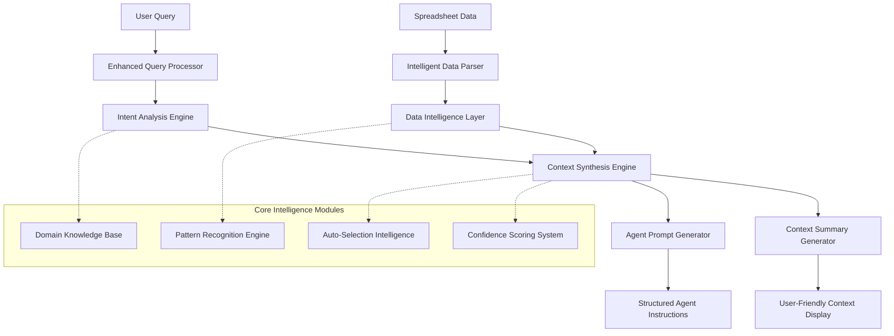

# Design Document

## Overview

The Enhanced Contextual Understanding Engine is a sophisticated system that transforms generic spreadsheet analysis into intelligent, context-aware insights. It combines advanced data parsing, natural language processing, domain-specific intelligence, and automated reasoning to provide actionable agent prompts that surpass existing solutions.

## Architecture

### High-Level Architecture



### Component Architecture

The system consists of six main layers:

1. **Data Intelligence Layer**: Advanced parsing and data structure analysis
2. **Query Processing Layer**: Natural language understanding and intent recognition
3. **Context Synthesis Layer**: Intelligent data correlation and relationship mapping
4. **Domain Intelligence Layer**: Business and financial context understanding
5. **Agent Generation Layer**: Comprehensive prompt and instruction creation
6. **Presentation Layer**: User-friendly context summaries and confidence scoring

## Components and Interfaces

### 1. Enhanced Data Parser

**Purpose**: Intelligently parse and structure spreadsheet data with deep understanding of content and relationships.

**Key Features**:
- Advanced data type detection (financial instruments, currencies, percentages, dates)
- Automatic header and data boundary detection
- Relationship mapping between columns and rows
- Data quality assessment and anomaly detection
- Searchable content indexing for fast lookups

**Interface**:
```typescript
interface EnhancedDataParser {
  parseSpreadsheet(file: Buffer, metadata: FileMetadata): Promise<IntelligentSpreadsheetData>
  createSearchIndex(data: IntelligentSpreadsheetData): SearchIndex
  detectDataPatterns(data: IntelligentSpreadsheetData): DataPatterns
  assessDataQuality(data: IntelligentSpreadsheetData): QualityAssessment
}

interface IntelligentSpreadsheetData extends SpreadsheetData {
  searchIndex: SearchIndex
  dataPatterns: DataPatterns
  qualityMetrics: QualityAssessment
  domainContext: DomainContext
  columnMappings: ColumnMapping[]
}
```

### 2. Intent Analysis Engine

**Purpose**: Understand user queries with high accuracy and extract actionable intent with business context.

**Key Features**:
- Multi-layered intent classification (immediate action, analytical goal, business objective)
- Entity extraction and resolution (company names, financial terms, data references)
- Ambiguity detection and clarification suggestion
- Context-aware scope determination
- Confidence scoring with explanation

**Interface**:
```typescript
interface IntentAnalysisEngine {
  analyzeQuery(query: string, dataContext: IntelligentSpreadsheetData): Promise<EnhancedIntent>
  extractEntities(query: string): EntityExtractionResult
  resolveAmbiguities(intent: EnhancedIntent, dataContext: IntelligentSpreadsheetData): AmbiguityResolution
  calculateIntentConfidence(intent: EnhancedIntent): ConfidenceScore
}

interface EnhancedIntent {
  primaryIntent: IntentType
  secondaryIntents: IntentType[]
  entities: ExtractedEntity[]
  scope: AnalysisScope
  businessContext: BusinessContext
  confidence: ConfidenceScore
  clarificationNeeded: boolean
  suggestedClarifications: string[]
}
```

### 3. Auto-Selection Intelligence

**Purpose**: Automatically identify and select relevant data ranges based on query context and data relationships.

**Key Features**:
- Smart entity matching (fuzzy search, synonym recognition)
- Contextual range expansion (related columns, dependent data)
- Multi-criteria selection optimization
- Confidence-based selection ranking
- Visual selection explanation

**Interface**:
```typescript
interface AutoSelectionIntelligence {
  findRelevantData(query: EnhancedIntent, data: IntelligentSpreadsheetData): SelectionResult[]
  expandSelection(baseSelection: SelectionResult, context: SelectionContext): SelectionResult
  rankSelections(selections: SelectionResult[]): RankedSelection[]
  explainSelection(selection: SelectionResult): SelectionExplanation
}

interface SelectionResult {
  range: Range
  confidence: number
  matchType: MatchType
  relevantColumns: ColumnReference[]
  explanation: string
  relatedSelections: Range[]
}
```

### 4. Domain Intelligence Engine

**Purpose**: Apply domain-specific knowledge to enhance analysis and provide expert-level insights.

**Key Features**:
- Financial domain expertise (portfolio analysis, risk metrics, performance calculations)
- Business intelligence patterns (KPIs, trends, benchmarking)
- Industry-specific formula libraries
- Contextual validation rules
- Best practice recommendations

**Interface**:
```typescript
interface DomainIntelligenceEngine {
  identifyDomain(data: IntelligentSpreadsheetData): DomainClassification
  applyDomainKnowledge(intent: EnhancedIntent, domain: DomainClassification): DomainEnhancedAnalysis
  suggestDomainSpecificActions(analysis: DomainEnhancedAnalysis): ActionSuggestion[]
  validateDomainLogic(selection: SelectionResult, domain: DomainClassification): ValidationResult
}

interface DomainClassification {
  primaryDomain: DomainType
  subDomains: DomainType[]
  confidence: number
  applicableRules: DomainRule[]
  suggestedMetrics: MetricDefinition[]
}
```

### 5. Context Synthesis Engine

**Purpose**: Combine all intelligence layers to create comprehensive, actionable context understanding.

**Key Features**:
- Multi-source data correlation
- Relationship mapping and dependency analysis
- Insight generation and prioritization
- Risk and opportunity identification
- Comprehensive confidence modeling

**Interface**:
```typescript
interface ContextSynthesisEngine {
  synthesizeContext(
    intent: EnhancedIntent,
    selection: SelectionResult,
    domainAnalysis: DomainEnhancedAnalysis,
    data: IntelligentSpreadsheetData
  ): ComprehensiveContext
  
  generateInsights(context: ComprehensiveContext): ContextInsight[]
  assessRisksAndOpportunities(context: ComprehensiveContext): RiskOpportunityAnalysis
  calculateOverallConfidence(context: ComprehensiveContext): OverallConfidence
}

interface ComprehensiveContext {
  dataContext: DataContext
  businessContext: BusinessContext
  analyticalContext: AnalyticalContext
  insights: ContextInsight[]
  risks: Risk[]
  opportunities: Opportunity[]
  confidence: OverallConfidence
  nextSteps: RecommendedAction[]
}
```

### 6. Agent Prompt Generator

**Purpose**: Create detailed, executable instructions for automated agents with comprehensive context and validation.

**Key Features**:
- Multi-format instruction generation (natural language, step-by-step, formulas)
- Comprehensive context inclusion
- Error handling and validation steps
- Alternative approach suggestions
- Performance optimization recommendations

**Interface**:
```typescript
interface AgentPromptGenerator {
  generateAgentPrompt(context: ComprehensiveContext): AgentPrompt
  createExecutionSteps(prompt: AgentPrompt): ExecutionStep[]
  addValidationSteps(steps: ExecutionStep[]): ValidatedExecutionPlan
  optimizeForPerformance(plan: ValidatedExecutionPlan): OptimizedExecutionPlan
}

interface AgentPrompt {
  summary: string
  detailedInstructions: string
  stepByStepActions: ExecutionStep[]
  excelFormulas: FormulaInstruction[]
  contextualInformation: ContextualInfo
  validationSteps: ValidationStep[]
  errorHandling: ErrorHandlingStrategy[]
  alternativeApproaches: AlternativeApproach[]
  expectedOutcome: ExpectedResult
  confidenceIndicators: ConfidenceIndicator[]
}
```

## Data Models

### Enhanced Data Structures

```typescript
// Core enhanced data model
interface IntelligentSpreadsheetData extends SpreadsheetData {
  searchIndex: {
    byContent: Map<string, CellReference[]>
    byColumn: Map<string, ColumnInfo>
    byDataType: Map<DataType, CellReference[]>
    byPattern: Map<PatternType, PatternMatch[]>
  }
  
  domainContext: {
    detectedDomain: DomainType
    confidence: number
    applicableRules: DomainRule[]
    suggestedAnalytics: AnalyticSuggestion[]
  }
  
  qualityMetrics: {
    completeness: number
    consistency: number
    accuracy: number
    timeliness: number
    issues: DataQualityIssue[]
  }
  
  relationships: {
    columnDependencies: ColumnDependency[]
    dataHierarchies: DataHierarchy[]
    calculatedFields: CalculatedField[]
  }
}

// Enhanced intent and context models
interface EnhancedIntent {
  query: {
    original: string
    normalized: string
    entities: ExtractedEntity[]
  }
  
  intent: {
    primary: IntentClassification
    secondary: IntentClassification[]
    confidence: number
    ambiguities: Ambiguity[]
  }
  
  scope: {
    dataScope: DataScope
    analyticalScope: AnalyticalScope
    temporalScope: TemporalScope
  }
  
  context: {
    businessContext: BusinessContext
    userContext: UserContext
    sessionContext: SessionContext
  }
}

// Comprehensive agent instruction model
interface AgentPrompt {
  metadata: {
    promptId: string
    generatedAt: Date
    confidence: OverallConfidence
    estimatedComplexity: ComplexityLevel
  }
  
  instructions: {
    summary: string
    naturalLanguage: string
    stepByStep: ExecutionStep[]
    technicalDetails: TechnicalInstruction[]
  }
  
  context: {
    dataContext: string
    businessRationale: string
    expectedOutcome: string
    successCriteria: string[]
  }
  
  execution: {
    primaryApproach: ExecutionApproach
    alternativeApproaches: ExecutionApproach[]
    validationSteps: ValidationStep[]
    errorHandling: ErrorHandlingStep[]
  }
  
  formulas: {
    required: FormulaInstruction[]
    optional: FormulaInstruction[]
    validation: FormulaInstruction[]
  }
}
```

## Error Handling

### Comprehensive Error Management Strategy

1. **Data Quality Issues**
   - Missing data detection and handling strategies
   - Inconsistent data type resolution
   - Outlier identification and treatment options
   - Data validation rule violations

2. **Query Understanding Errors**
   - Ambiguous intent clarification workflows
   - Entity resolution failures and alternatives
   - Scope determination uncertainties
   - Confidence threshold management

3. **Selection and Analysis Errors**
   - No matching data found scenarios
   - Multiple ambiguous matches handling
   - Insufficient data for analysis cases
   - Domain rule violation management

4. **Agent Prompt Generation Errors**
   - Complex query decomposition failures
   - Formula generation errors
   - Validation step creation issues
   - Performance optimization conflicts

## Testing Strategy

### Multi-Layer Testing Approach

1. **Unit Testing**
   - Individual component functionality
   - Data parsing accuracy
   - Intent classification precision
   - Formula generation correctness

2. **Integration Testing**
   - End-to-end workflow validation
   - Component interaction verification
   - Data flow integrity checks
   - Performance benchmarking

3. **Domain-Specific Testing**
   - Financial data analysis accuracy
   - Business intelligence correctness
   - Industry-specific validation
   - Expert knowledge verification

4. **User Experience Testing**
   - Query understanding accuracy
   - Response relevance and usefulness
   - Agent prompt executability
   - Confidence score reliability

5. **Performance Testing**
   - Large dataset processing speed
   - Memory usage optimization
   - Concurrent user handling
   - Response time consistency

### Test Data Sets

1. **Financial Portfolio Data** (like the provided CSV)
2. **Sales and Marketing Analytics**
3. **Operational KPI Dashboards**
4. **Scientific Research Data**
5. **Educational Grade Books**
6. **Inventory Management Systems**

Each test set will include:
- Clean, well-structured data
- Data with quality issues
- Complex multi-sheet workbooks
- Large datasets (10,000+ rows)
- Domain-specific edge cases