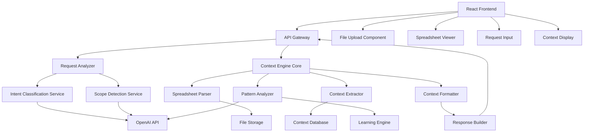

# Design Document

## Overview

The Excel Context Engine is designed as a microservices-based system that intelligently analyzes user requests in spreadsheet environments and generates optimal context for LLM processing. The system employs a multi-layered architecture combining rule-based analysis, machine learning, and OpenAI API integration to understand user intent and extract relevant contextual information from spreadsheet data.

The engine operates as a standalone service with RESTful APIs, making it easily integrable with various spreadsheet applications and tools. It processes spreadsheet files, analyzes user requests, and returns structured context that enables LLMs to provide precise, actionable responses.

**Technology Stack**:

- **Backend**: Node.js with TypeScript for type safety and developer experience
- **Framework**: Express.js for RESTful API development
- **Database**: PostgreSQL for structured data with JSONB support for flexible context storage
- **File Processing**: SheetJS (xlsx library) for Excel file parsing
- **AI Integration**: OpenAI API (GPT-4) for intelligent analysis
- **Frontend**: React with TypeScript for the user interface
- **UI Framework**: Tailwind CSS for styling with shadcn/ui components
- **State Management**: React Query for API state management
- **File Upload**: React Dropzone for drag-and-drop file uploads
- **Data Visualization**: Recharts for displaying spreadsheet data and insights
- **Testing**: Jest for backend, React Testing Library for frontend
- **Documentation**: OpenAPI/Swagger for API documentation

## Architecture

### High-Level Architecture



### Service Architecture

The system follows a microservices pattern with the following core services:

1. **API Gateway**: Entry point handling authentication, rate limiting, and request routing
2. **Request Analyzer**: Processes user requests to determine intent and scope
3. **Context Engine Core**: Orchestrates context extraction and analysis
4. **Spreadsheet Parser**: Handles file parsing and data extraction
5. **Pattern Analyzer**: Identifies data patterns and relationships using AI
6. **Learning Engine**: Manages feedback processing and model improvement

### Frontend Architecture

The React frontend provides a clean, intuitive interface for interacting with the context engine:

**Core Components**:

- **File Upload Zone**: Drag-and-drop interface for Excel/CSV files
- **Spreadsheet Viewer**: Interactive grid displaying uploaded spreadsheet data
- **Request Input**: Natural language input with suggestions and autocomplete
- **Context Display**: Visual representation of generated context (JSON + natural language)
- **Results Panel**: Shows LLM responses and suggested actions
- **History Sidebar**: Previous requests and context for session continuity

**User Flow**:

1. User uploads spreadsheet file via drag-and-drop
2. System displays spreadsheet data in an interactive grid
3. User selects cells/ranges and enters natural language request
4. System shows generated context and LLM response
5. User can refine request or apply suggested actions

## Components and Interfaces

### Frontend Components

#### 1. File Upload Component

**Purpose**: Handles file upload with drag-and-drop functionality

**Key Features**:

- Drag-and-drop file upload
- File format validation
- Upload progress indication
- Error handling for invalid files

**Props Interface**:

```typescript
interface FileUploadProps {
  onFileUpload: (file: File) => void;
  acceptedFormats: string[];
  maxFileSize: number;
  isUploading: boolean;
}
```

#### 2. Spreadsheet Viewer Component

**Purpose**: Displays spreadsheet data in an interactive grid

**Key Features**:

- Cell selection and range selection
- Formula display in formula bar
- Data type indicators
- Responsive grid layout

**Props Interface**:

```typescript
interface SpreadsheetViewerProps {
  data: SpreadsheetData;
  selectedRange: string;
  onSelectionChange: (range: string) => void;
  onCellClick: (cell: string) => void;
}
```

#### 3. Request Input Component

**Purpose**: Natural language input with intelligent suggestions

**Key Features**:

- Auto-complete based on context
- Request history
- Intent prediction indicators
- Voice input support (future)

**Props Interface**:

```typescript
interface RequestInputProps {
  onSubmit: (request: string) => void;
  suggestions: string[];
  isProcessing: boolean;
  placeholder: string;
}
```

#### 4. Context Display Component

**Purpose**: Visualizes generated context in user-friendly format

**Key Features**:

- Tabbed view (JSON/Natural Language/Visual)
- Syntax highlighting for JSON
- Confidence indicators
- Expandable sections

**Props Interface**:

```typescript
interface ContextDisplayProps {
  context: ContextData;
  naturalLanguage: string;
  confidence: number;
  isLoading: boolean;
}
```

### Backend Components

#### 1. API Gateway

**Purpose**: Serves as the main entry point for all client requests

**Key Interfaces**:

- `POST /api/v1/analyze-context` - Main context analysis endpoint
- `POST /api/v1/upload-spreadsheet` - File upload endpoint
- `GET /api/v1/health` - Health check endpoint

**Input Schema**:

```json
{
  "request": "string (user's natural language request)",
  "spreadsheet_id": "string (optional, if file already uploaded)",
  "file": "multipart/form-data (optional, for new file upload)",
  "current_selection": {
    "sheet": "string",
    "range": "string (e.g., 'A1:C10')",
    "active_cell": "string (e.g., 'B5')"
  },
  "user_context": {
    "recent_actions": ["array of recent user actions"],
    "session_id": "string"
  }
}
```

### 2. Request Analyzer

**Purpose**: Analyzes user requests to determine intent and scope

**Core Methods**:

- `classifyIntent(request: string): IntentType`
- `detectScope(request: string, context: SpreadsheetContext): ScopeInfo`
- `generateClarificationQuestions(request: string): string[]`

**Intent Classifications**:

- Formula assistance (creation, debugging, optimization)
- Data analysis (statistics, trends, insights)
- Formatting (styling, conditional formatting)
- Data manipulation (sorting, filtering, transforming)
- Troubleshooting (error resolution, validation)
- General assistance (explanations, tutorials)

### 3. Spreadsheet Parser

**Purpose**: Parses various spreadsheet formats and extracts structured data

**Supported Formats**:

- Excel (.xlsx, .xls)
- CSV (.csv)

**Core Methods**:

- `parseFile(file: File): SpreadsheetData`
- `extractFormulas(sheet: Sheet): Formula[]`
- `identifyDataTypes(range: Range): DataTypeInfo`
- `mapDependencies(sheet: Sheet): DependencyGraph`

**Data Structures**:

```typescript
interface SpreadsheetData {
  sheets: Sheet[];
  metadata: FileMetadata;
  formulas: Formula[];
  namedRanges: NamedRange[];
}

interface Sheet {
  name: string;
  data: Cell[][];
  dimensions: { rows: number; cols: number };
  formatting: FormatInfo[];
}

interface Cell {
  value: any;
  formula?: string;
  dataType: DataType;
  formatting?: CellFormat;
  dependencies?: string[];
}
```

### 4. Context Extractor

**Purpose**: Extracts relevant contextual information based on request analysis

**Core Methods**:

- `extractRelevantData(scope: ScopeInfo, spreadsheet: SpreadsheetData): ContextData`
- `identifyRelatedCells(targetRange: Range, spreadsheet: SpreadsheetData): Cell[]`
- `extractHistoricalContext(sessionId: string): HistoricalContext`
- `generateDataSummary(data: ContextData): DataSummary`

**Context Types**:

- **Immediate Context**: Current selection, active cell, visible data
- **Related Context**: Dependent/precedent cells, related formulas
- **Structural Context**: Headers, data types, sheet organization
- **Historical Context**: Recent changes, user patterns, previous requests

### 5. Pattern Analyzer

**Purpose**: Uses AI to identify complex patterns and relationships in data

**Integration with OpenAI API**:

- **Model**: GPT-4 for complex pattern recognition
- **Prompts**: Specialized prompts for data analysis and relationship identification
- **Fallback**: Rule-based analysis when API is unavailable

**Core Methods**:

- `analyzeDataPatterns(data: ContextData): PatternInsights`
- `identifyAnomalies(data: ContextData): Anomaly[]`
- `suggestRelationships(data: ContextData): Relationship[]`
- `generateInsights(data: ContextData): Insight[]`

### 6. Context Formatter

**Purpose**: Formats extracted context for optimal LLM consumption

**Output Formats**:

**Structured JSON**:

```json
{
  "request_analysis": {
    "intent": "formula_assistance",
    "scope": "current_selection",
    "confidence": 0.95
  },
  "spreadsheet_context": {
    "current_selection": {
      "range": "A1:C10",
      "data": [...],
      "data_types": ["text", "number", "date"]
    },
    "related_formulas": [...],
    "dependencies": [...],
    "data_summary": {
      "row_count": 10,
      "patterns": ["increasing_trend", "missing_values"],
      "statistics": {...}
    }
  },
  "actionable_info": {
    "target_cells": ["D1:D10"],
    "suggested_operations": ["SUM", "AVERAGE"],
    "constraints": ["non_empty_cells_only"]
  }
}
```

**Natural Language Description**:

```
The user is working with a dataset in range A1:C10 containing sales data with columns for Date (A), Product (B), and Revenue (C). They have selected cell D1 and appear to want help creating a formula. The data shows an increasing trend in revenue over time, with some missing values in column C. Based on the context, they likely want to calculate totals or averages for the revenue column.
```

## Data Models

### Core Data Models

```typescript
// Request Processing
interface AnalysisRequest {
  id: string;
  request: string;
  spreadsheetId?: string;
  currentSelection: SelectionInfo;
  userContext: UserContext;
  timestamp: Date;
}

interface SelectionInfo {
  sheet: string;
  range: string;
  activeCell: string;
  visibleRange?: string;
}

interface UserContext {
  sessionId: string;
  recentActions: UserAction[];
  preferences: UserPreferences;
}

// Context Data
interface ContextData {
  immediate: ImmediateContext;
  related: RelatedContext;
  structural: StructuralContext;
  historical: HistoricalContext;
  patterns: PatternInsights;
}

interface ImmediateContext {
  selectedData: Cell[][];
  activeCell: Cell;
  visibleData: Cell[][];
  currentFormulas: Formula[];
}

interface RelatedContext {
  dependentCells: Cell[];
  precedentCells: Cell[];
  relatedFormulas: Formula[];
  namedRanges: NamedRange[];
}

// AI Integration
interface PatternInsights {
  dataPatterns: DataPattern[];
  relationships: Relationship[];
  anomalies: Anomaly[];
  insights: Insight[];
  confidence: number;
}

interface OpenAIRequest {
  model: string;
  messages: ChatMessage[];
  temperature: number;
  maxTokens: number;
}
```

### Database Schema

```sql
-- Context Storage
CREATE TABLE contexts (
    id UUID PRIMARY KEY,
    request_id UUID NOT NULL,
    context_type VARCHAR(50) NOT NULL,
    context_data JSONB NOT NULL,
    confidence_score DECIMAL(3,2),
    created_at TIMESTAMP DEFAULT NOW()
);

-- Learning Data
CREATE TABLE feedback (
    id UUID PRIMARY KEY,
    request_id UUID NOT NULL,
    predicted_context JSONB NOT NULL,
    actual_context JSONB,
    user_satisfaction INTEGER CHECK (user_satisfaction BETWEEN 1 AND 5),
    created_at TIMESTAMP DEFAULT NOW()
);

-- Session Management
CREATE TABLE sessions (
    id UUID PRIMARY KEY,
    user_id VARCHAR(255),
    spreadsheet_id UUID,
    actions JSONB[],
    created_at TIMESTAMP DEFAULT NOW(),
    updated_at TIMESTAMP DEFAULT NOW()
);
```

## Error Handling

### Error Categories

1. **Input Validation Errors**
   - Invalid file formats
   - Malformed requests
   - Missing required parameters

2. **Processing Errors**
   - File parsing failures
   - OpenAI API errors
   - Context extraction failures

3. **System Errors**
   - Database connection issues
   - Service unavailability
   - Rate limiting

### Error Response Format

```json
{
  "error": {
    "code": "INVALID_FILE_FORMAT",
    "message": "The uploaded file format is not supported",
    "details": {
      "supported_formats": [".xlsx", ".xls", ".csv"],
      "received_format": ".txt"
    },
    "suggestions": [
      "Convert your file to Excel format (.xlsx)",
      "Save as CSV if working with simple data"
    ]
  },
  "request_id": "req_123456789"
}
```

### Fallback Strategies

1. **OpenAI API Unavailable**: Fall back to rule-based pattern analysis
2. **File Parsing Errors**: Attempt alternative parsing methods
3. **Context Extraction Failures**: Return basic context with warnings
4. **Ambiguous Requests**: Generate clarification questions

## Testing Strategy

### Unit Testing

**Components to Test**:

- Request analyzer intent classification
- Spreadsheet parser for various formats
- Context extractor logic
- Pattern analyzer algorithms
- Context formatter output

**Testing Framework**: Jest with TypeScript support

**Mock Strategy**:

- Mock OpenAI API responses
- Mock file system operations
- Mock database connections

### Integration Testing

**Test Scenarios**:

- End-to-end request processing
- OpenAI API integration
- Database operations
- File upload and parsing

**Test Data**:

- Sample Excel files with various data types
- Complex formulas and dependencies
- Large datasets for performance testing

### Performance Testing

**Metrics to Monitor**:

- Response time for context generation
- Memory usage during file parsing
- OpenAI API response times
- Database query performance

**Load Testing**:

- Concurrent request handling
- Large file processing
- High-frequency API calls

### User Acceptance Testing

**Test Cases**:

- Real-world spreadsheet scenarios
- Various user request types
- Context accuracy validation
- LLM response quality with generated context

**Success Criteria**:

- Context relevance score > 85%
- Response time < 3 seconds for typical requests
- User satisfaction score > 4/5
- Successful handling of edge cases
